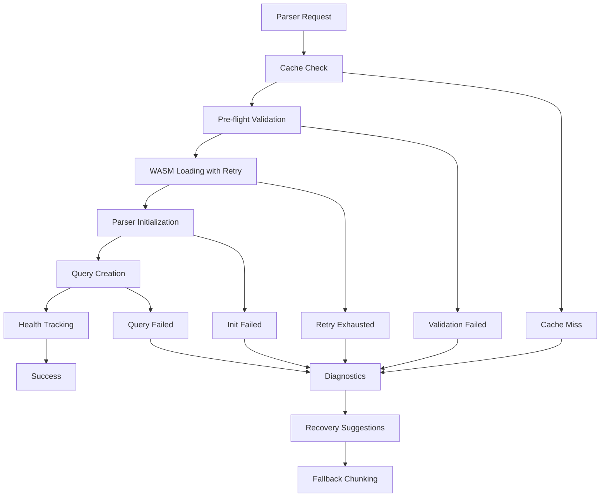
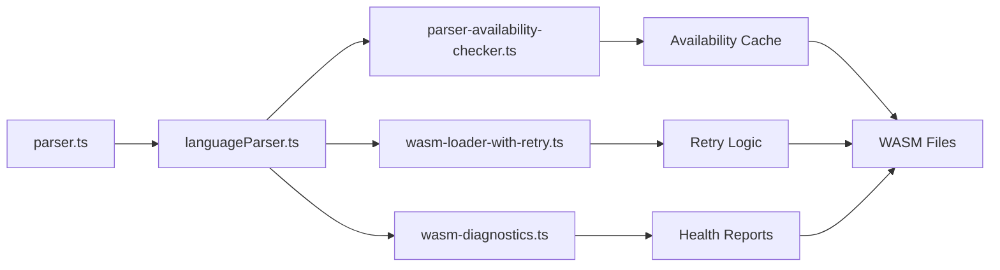

# WASM Loading Fix Guide

## Table of Contents

1. [Overview](#overview)
2. [Architecture](#architecture)
3. [Implementation Details](#implementation-details)
4. [Fallback Trigger Fixes](#fallback-trigger-fixes)
5. [Configuration](#configuration)
6. [Monitoring](#monitoring)
7. [Troubleshooting](#troubleshooting)
8. [Testing](#testing)
9. [Migration Guide](#migration-guide)

---

## Overview

This guide explains the comprehensive WASM loading system implemented to address the four critical fallback triggers (#2, #3, #4, #5) that were causing systematic fallback to line-based chunking. The new system employs a defense-in-depth strategy with pre-flight checks, retry logic, and enhanced diagnostics to ensure robust tree-sitter parser loading.

### The Four WASM-Related Fallback Triggers

1. **Trigger #2: Parser Load Failed** - Tree-sitter parser initialization fails
2. **Trigger #3: WASM Directory Unavailable** - Tree-sitter WASM directory not found
3. **Trigger #4: Parser Loading Exception** - Runtime error during parser module instantiation
4. **Trigger #5: No Parser Available** - Parser object is null/undefined after initialization attempts

### Systematic Approach to Fixes

The implementation follows a layered approach:

1. **Pre-flight Validation**: Check parser availability before attempting loading
2. **Retry Logic**: Exponential backoff for transient failures
3. **Health Caching**: Track parser availability to prevent repeated failures
4. **Enhanced Diagnostics**: Provide actionable recovery suggestions
5. **Graceful Degradation**: Fallback mechanisms when all else fails

### Defense-in-Depth Strategy



---

## Architecture

The new WASM loading system consists of several interconnected modules that work together to provide robust parser loading:

### System Flow Diagram



### Module Responsibilities

#### 1. parser.ts (Entry Point)

- Orchestrates the parsing workflow
- Handles fallback triggers and recovery
- Integrates with the code indexing pipeline

#### 2. languageParser.ts (Coordinator)

- Manages parser loading and lifecycle
- Coordinates between all WASM-related modules
- Implements the main `loadRequiredLanguageParsers()` function
- Handles comprehensive query creation and testing

#### 3. parser-availability-checker.ts (Pre-flight Validation)

- Validates WASM files before loading attempts
- Maintains availability cache with TTL
- Provides batch availability checking
- Tracks parser health metrics

#### 4. wasm-loader-with-retry.ts (Retry Engine)

- Implements exponential backoff retry logic
- Classifies errors as retryable vs. permanent
- Provides timeout protection for loading operations
- Tracks loading metrics and performance

#### 5. wasm-diagnostics.ts (Health Monitoring)

- Generates comprehensive diagnostic reports
- Provides actionable recovery suggestions
- Validates WASM file integrity
- Estimates recovery times

### Availability Cache Mechanism

The availability cache prevents repeated failed attempts to load problematic parsers:

```typescript
interface ParserAvailabilityStatus {
	available: boolean
	lastChecked: number
	error?: string
}

class ParserAvailabilityCache {
	private cache: Map<string, ParserAvailabilityStatus>
	private readonly ttlMs: number = 5 * 60 * 1000 // 5 minutes
}
```

**Key Features:**

- Time-based cache invalidation (5-minute TTL)
- Health tracking with success/failure metrics
- Cache warming for frequently used parsers
- Manual cache invalidation for recovery operations

---

## Implementation Details

### Pre-flight Checks

The `checkParserAvailability()` function validates WASM files before attempting to load them:

```typescript
export async function checkParserAvailability(
	language: string,
	wasmDir?: string,
	metricsCollector?: MetricsCollector,
): Promise<ParserAvailabilityStatus> {
	// Check WASM directory existence
	// Validate specific WASM file for language
	// Test file integrity (size > 1KB)
	// Update availability cache
	// Record metrics
}
```

**Validation Steps:**

1. Verify WASM directory exists and is accessible
2. Check for language-specific WASM file (`tree-sitter-${language}.wasm`)
3. Validate file integrity (minimum size check)
4. Update cache with results
5. Record metrics for monitoring

### Retry Logic with Exponential Backoff

The `loadLanguageWithRetry()` function handles transient failures intelligently:

```typescript
export async function loadLanguageWithRetry(
	language: string,
	wasmDirectory: string,
	parser: any,
	options: WasmLoadOptions = {},
): Promise<WasmLoadResult> {
	// Implements exponential backoff with jitter
	// Classifies errors for retry eligibility
	// Provides timeout protection
	// Tracks detailed metrics
}
```

**Retry Configuration:**

```typescript
const DEFAULT_OPTIONS: Required<WasmLoadOptions> = {
	maxRetries: 3, // Maximum retry attempts
	initialDelayMs: 100, // Initial delay before first retry
	maxDelayMs: 2000, // Maximum delay between retries
	backoffMultiplier: 2, // Exponential backoff factor
	timeoutMs: 30000, // Timeout for each loading attempt
}
```

**Backoff Calculation with Jitter:**

```typescript
function calculateBackoffDelay(attempt: number, options: Required<WasmLoadOptions>): number {
	const baseDelay = options.initialDelayMs * Math.pow(options.backoffMultiplier, attempt)
	const jitter = Math.random() * 100 // Add randomness to prevent thundering herd
	return Math.min(options.maxDelayMs, baseDelay + jitter)
}
```

### Error Classification

The `shouldRetryError()` function distinguishes between transient and permanent errors:

**Retryable (Transient) Errors:**

- Network-related issues (ENOENT, EACCES, ETIMEDOUT, ECONNREFUSED)
- Temporary file system issues
- Parser initialization failures

**Non-Retryable (Permanent) Errors:**

- HTTP 404/403 (permanent missing/forbidden)
- Invalid WASM format
- WASM validation failures
- Syntax errors in WASM modules

### Health Tracking

The parser availability cache tracks health metrics to prevent repeated failures:

```typescript
interface CacheHealthReport {
	totalEntries: number
	healthyEntries: number
	staleEntries: number
	averageAge: number
	oldestEntry: number
	newestEntry: number
}
```

**Health Features:**

- Automatic stale entry cleanup
- Success/failure ratio tracking
- Cache hit/miss metrics
- Age-based invalidation

### Enhanced Diagnostics

The `diagnoseWasmSetup()` function provides comprehensive health reports:

```typescript
export interface DiagnosticReport {
	wasmDirectory: string
	wasmDirectoryExists: boolean
	criticalFiles: WasmFileStatus[]
	optionalFiles: WasmFileStatus[]
	missingCriticalFiles: string[]
	totalFiles: number
	totalSize: number
	webTreeSitterVersion: string | null
	treeSitterWasmsVersion: string | null
	recommendations: string[]
	isHealthy: boolean
	recoverySuggestions: RecoverySuggestion[]
	canAutoRecover: boolean
	estimatedRecoveryTime: number
}
```

**Diagnostic Features:**

- Critical file validation (tree-sitter.wasm, JavaScript, TypeScript, Python)
- Optional file reporting
- Version information tracking
- Actionable recovery suggestions
- Automated recovery time estimation

---

## Fallback Trigger Fixes

### Trigger #2: Parser Load Failed

**Previous Behavior:**

```typescript
try {
	const parser = await this.getParserForLanguage(language)
	// ... semantic parsing logic
} catch (error) {
	this.recordFallbackChunkingTrigger(language, "parser_load_failed")
	return this.fallbackChunking(content, filePath, language)
}
```

**New Implementation:**

```typescript
// Pre-flight availability check
const availabilityStatus = await checkParserAvailabilityWithCache(language, wasmDirectory, metricsCollector)

if (!availabilityStatus.available) {
	logger.warn(`Parser ${language} unavailable: ${availabilityStatus.error}`, "CodeParser")
	this.recordFallbackChunkingTrigger(language, "parser_unavailable")
	return this.fallbackChunking(content, filePath, language)
}

// Load with retry logic
const languageParsers = await loadRequiredLanguageParsers([filePath], undefined, metricsCollector)
```

**Improvements:**

1. Pre-flight validation prevents unnecessary load attempts
2. Retry logic handles transient failures
3. Availability cache prevents repeated failures
4. Enhanced error reporting with recovery suggestions

### Trigger #3: WASM Directory Unavailable

**Previous Behavior:**

```typescript
const wasmDir = path.join(this.extensionPath, "tree-sitter-wasms")
if (!fs.existsSync(wasmDir)) {
	this.recordFallbackChunkingTrigger(language, "wasm_directory_unavailable")
	return this.fallbackChunking(content, filePath, language)
}
```

**New Implementation:**

```typescript
// Use enhanced WASM directory resolution with retry
let wasmDirectory: string
try {
	wasmDirectory = await getWasmDirectoryWithRetry(3, 1000) // 3 retries, 1s delay
} catch (error) {
	logger.error(`Failed to resolve WASM directory: ${error.message}`, "CodeParser")

	// Generate diagnostic report
	const diagnosticReport = diagnoseWasmSetup()
	const formattedReport = formatDiagnosticReport(diagnosticReport)
	logger.error(formattedReport, "CodeParser")

	this.recordFallbackChunkingTrigger(language, "wasm_directory_unavailable")
	return this.fallbackChunking(content, filePath, language)
}
```

**Improvements:**

1. Multiple resolution attempts with different strategies
2. Comprehensive diagnostic reporting
3. Actionable recovery suggestions
4. Fallback to alternative directory locations

### Trigger #4: Parser Loading Exception

**Previous Behavior:**

```typescript
try {
	const languageModule = await import(wasmPath)
	parser = new languageModule.default()
} catch (error) {
	this.recordFallbackChunkingTrigger(language, "parser_loading_exception")
	return this.fallbackChunking(content, filePath, language)
}
```

**New Implementation:**

```typescript
// Load with retry and error classification
const loadResult = await loadLanguageWithRetry(language, wasmDirectory, Parser, retryOptions)

if (!loadResult.success) {
	const isTransient = shouldRetryError(loadResult.error!)
	const errorType = isTransient ? "transient" : "permanent"

	logger.warn(`Parser loading ${errorType} error for ${language}: ${loadResult.error?.message}`, "CodeParser")

	// Update availability cache
	parserAvailabilityCache.set(language, {
		available: false,
		error: loadResult.error?.message,
	})

	this.recordFallbackChunkingTrigger(language, "parser_loading_exception")
	return this.fallbackChunking(content, filePath, language)
}
```

**Improvements:**

1. Error classification for appropriate handling
2. Availability cache updates to prevent repeated failures
3. Detailed error reporting with context
4. Retry logic for transient issues

### Trigger #5: No Parser Available

**Previous Behavior:**

```typescript
if (!parser) {
	this.recordFallbackChunkingTrigger(language, "no_parser_available")
	return this.fallbackChunking(content, filePath, language)
}
```

**New Implementation:**

```typescript
// Attempt parser reload before giving up
if (!parser) {
	logger.info(`No parser available for ${language}, attempting reload`, "CodeParser")

	const reloadResult = await reloadParser(language, wasmDirectory)
	if (reloadResult.success) {
		parser = languageParserMap[language]?.parser
	}

	if (!parser) {
		// Final fallback with enhanced diagnostics
		const diagnosticReport = diagnoseWasmSetup(wasmDirectory)

		logger.error(`No parser available for ${language} after reload attempt`, "CodeParser")
		if (diagnosticReport.missingCriticalFiles.length > 0) {
			logger.error(`Missing critical files: ${diagnosticReport.missingCriticalFiles.join(", ")}`, "CodeParser")
		}

		this.recordFallbackChunkingTrigger(language, "no_parser_available")
		return this.fallbackChunking(content, filePath, language)
	}
}
```

**Improvements:**

1. Automatic parser reload attempt before fallback
2. Enhanced diagnostics to identify root cause
3. Specific error reporting for missing critical files
4. Recovery suggestion generation

---

## Configuration

### Retry Options

The retry behavior can be configured through the `WasmLoadOptions` interface:

```typescript
export interface WasmLoadOptions {
	maxRetries?: number // Default: 3
	initialDelayMs?: number // Default: 100
	maxDelayMs?: number // Default: 2000
	backoffMultiplier?: number // Default: 2
	timeoutMs?: number // Default: 30000
}
```

**Example Configuration:**

```typescript
// For unreliable networks
const unreliableNetworkOptions: WasmLoadOptions = {
	maxRetries: 5,
	initialDelayMs: 500,
	maxDelayMs: 5000,
	backoffMultiplier: 1.5,
	timeoutMs: 60000,
}

// For fast, reliable environments
const fastEnvironmentOptions: WasmLoadOptions = {
	maxRetries: 1,
	initialDelayMs: 50,
	maxDelayMs: 1000,
	backoffMultiplier: 2,
	timeoutMs: 10000,
}
```

### Cache TTL Settings

The parser availability cache uses a configurable TTL:

```typescript
class ParserAvailabilityCache {
	private readonly ttlMs: number = 5 * 60 * 1000 // 5 minutes default
}
```

**Cache Behavior:**

- Entries expire after 5 minutes of inactivity
- Stale entries are automatically removed on access
- Manual invalidation available for recovery operations
- Health monitoring tracks cache efficiency

### Strict Mode Behavior

The system supports strict WASM loading mode:

```typescript
function getStrictWasmLoading(): boolean {
	const config = vscode.workspace.getConfiguration("roo-code")
	return config.get("treeSitterStrictWasmLoading", false)
}
```

**Strict Mode Effects:**

- Throws errors instead of falling back to line-based chunking
- Requires all critical WASM files to be present
- Disables automatic fallback mechanisms
- Provides immediate feedback on configuration issues

### Environment Variables for Testing

Several environment variables control behavior for testing:

```bash
# Enable development mode
NODE_ENV=development

# Disable strict loading
ROO_CODE_STRICT_WASM_LOADING=false

# Enable debug logging
ROO_CODE_DEBUG_WASM_LOADING=true

# Force cache invalidation
ROO_CODE_INVALIDATE_WASM_CACHE=true
```

---

## Monitoring

### Metrics Collection

The system collects comprehensive metrics for WASM loading operations:

```typescript
// Metrics collected by MetricsCollector
metricsCollector.recordParserMetric(language, "loadAttempt") // Loading attempts
metricsCollector.recordParserMetric(language, "loadSuccess") // Successful loads
metricsCollector.recordParserMetric(language, "loadFailure") // Failed loads
metricsCollector.recordParserMetric(language, "fallback") // Fallback operations
metricsCollector.recordParserMetric(language, "cacheHit") // Cache hits
metricsCollector.recordParserMetric(language, "cacheMiss") // Cache misses
```

**Telemetry Events:**

```typescript
// Telemetry events captured
TelemetryService.instance.captureWasmLoadAttempt(language)
TelemetryService.instance.captureWasmLoadSuccess(language, wasmPath, duration)
TelemetryService.instance.captureWasmLoadFailure(language, errorMessage, isRetryable)
```

### Health Check Endpoints

The system provides health information through several interfaces:

1. **Cache Health Report:**

```typescript
const healthReport = parserAvailabilityCache.getHealthReport()
// Returns: totalEntries, healthyEntries, staleEntries, averageAge, etc.
```

2. **WASM Setup Diagnostics:**

```typescript
const diagnosticReport = diagnoseWasmDirectory(wasmDirectory)
// Returns: file status, recommendations, recovery suggestions
```

3. **Parser Validation:**

```typescript
const validationReport = await validateAllParsers()
// Returns: available/unavailable parsers with detailed status
```

### Diagnostic Report Format

The diagnostic report provides a comprehensive view of WASM system health:

```
=== Tree-sitter WASM Diagnostics ===
WASM Directory: /path/to/wasms/tree-sitter
Directory Exists: ✓

Critical Files Status:
✓ tree-sitter.wasm (2.1MB)
✓ tree-sitter-javascript.wasm (1.8MB)
✗ tree-sitter-typescript.wasm (MISSING)
✓ tree-sitter-python.wasm (1.5MB)

Optional Files Status:
✓ tree-sitter-rust.wasm (1.9MB)
✓ tree-sitter-go.wasm (1.7MB)
...

Health Score: 75/100
Issues Found:
- Missing critical file: tree-sitter-typescript.wasm
- 2 optional files missing

Recovery Suggestions:
1. Run 'Roo-Cline: Download Tree-sitter WASM Files' command
2. Verify network connectivity
3. Check disk space availability

Estimated Recovery Time: 2-3 minutes
=== End Diagnostic Report ===
```

### Alerting Thresholds

The system supports configurable alerting thresholds:

```typescript
// Example alerting configuration
const alertThresholds = {
	failureRate: 0.2, // Alert if >20% of loads fail
	avgLoadTime: 5000, // Alert if avg load time >5s
	cacheHitRate: 0.5, // Alert if cache hit rate <50%
	missingCriticalFiles: 1, // Alert if any critical files missing
}
```

---

## Troubleshooting

### Common Issues and Solutions

#### Issue 1: WASM Files Missing

**Symptoms:**

- All parser loads fail
- Diagnostic report shows missing critical files
- Fallback to line-based chunking for all files

**Solutions:**

1. Run the download command: `Roo-Cline: Download Tree-sitter WASM Files`
2. For development: `pnpm regenerate-wasms`
3. Verify network connectivity
4. Check disk space availability

#### Issue 2: Permission Denied Errors

**Symptoms:**

- EACCES errors in logs
- Random parser load failures
- Cache shows inconsistent availability

**Solutions:**

1. Check file permissions on WASM directory
2. Verify extension has read access
3. Check antivirus software interference
4. Reset permissions: `chmod -R 644 src/wasms/tree-sitter/`

#### Issue 3: Timeout Errors

**Symptoms:**

- ETIMEDOUT errors during loading
- Large WASM files fail to load
- Performance degradation over time

**Solutions:**

1. Increase timeout in configuration
2. Check system resource usage
3. Verify disk I/O performance
4. Consider reducing concurrent load operations

#### Issue 4: Cache Inconsistency

**Symptoms:**

- Parsers marked unavailable but files exist
- Stale cache entries causing failures
- Inconsistent behavior between restarts

**Solutions:**

1. Clear cache: `parserAvailabilityCache.invalidateAll()`
2. Set environment variable: `ROO_CODE_INVALIDATE_WASM_CACHE=true`
3. Check system clock synchronization
4. Verify cache TTL settings

### Interpreting Diagnostic Reports

**Health Score Interpretation:**

- 90-100: Optimal - All systems working correctly
- 70-89: Good - Minor issues, partial functionality
- 50-69: Warning - Significant issues, limited functionality
- 0-49: Critical - Major issues, minimal functionality

**Recovery Time Estimates:**

- <1 minute: Simple file downloads
- 1-5 minutes: Multiple file downloads with retries
- 5+ minutes: Network issues or large file downloads

### Recovery Commands

**Manual Recovery:**

```bash
# Download all WASM files
pnpm regenerate-wasms

# Verify installation
pnpm verify:wasms

# Clear caches
rm -rf ~/.vscode/extensions/.../wasm-cache

# Restart extension
code --disable-extensions && code
```

**Automated Recovery:**

```typescript
// Programmatic recovery
const recoveryResult = await attemptWasmRecovery({
	downloadMissingFiles: true,
	validateIntegrity: true,
	clearCache: true,
	reloadParsers: true,
})
```

### Manual WASM File Installation

For offline environments or custom installations:

1. **Download Required Files:**

```bash
# Core parser
curl -o src/wasms/tree-sitter/tree-sitter.wasm https://github.com/tree-sitter/tree-sitter/releases/latest/download/tree-sitter.wasm

# Language parsers
curl -o src/wasms/tree-sitter/tree-sitter-javascript.wasm https://github.com/tree-sitter/tree-sitter-javascript/releases/latest/download/tree-sitter-javascript.wasm
# ... repeat for each language
```

2. **Verify File Integrity:**

```bash
# Check file sizes (should be >1KB)
ls -la src/wasms/tree-sitter/*.wasm

# Verify WASM format
file src/wasms/tree-sitter/*.wasm
```

3. **Set Permissions:**

```bash
chmod 644 src/wasms/tree-sitter/*.wasm
```

---

## Testing

### Running the Test Suite

```bash
# Run all WASM-related tests
pnpm test -- --grep "WASM"

# Run specific test files
pnpm test src/services/tree-sitter/__tests__/wasm-loading-retry.test.ts
pnpm test src/services/tree-sitter/__tests__/parser-availability.test.ts

# Run with coverage
pnpm test --coverage -- --grep "WASM"
```

### Simulating WASM Loading Failures

The test suite includes comprehensive failure simulation:

```typescript
// Simulate network failures
vi.mock("fs", () => ({
	existsSync: vi.fn().mockReturnValue(false),
	statSync: vi.fn().mockImplementation(() => {
		throw new Error("ENOENT")
	}),
}))

// Simulate WASM loading errors
vi.mock("web-tree-sitter", () => ({
	Parser: {
		init: vi.fn().mockRejectedValue(new Error("Initialization failed")),
		Language: {
			load: vi.fn().mockRejectedValue(new Error("WASM load failed")),
		},
	},
}))
```

### Verifying Fixes Are Working

**1. Check Parser Availability:**

```typescript
const availability = await checkParserAvailability("javascript")
console.log(`JavaScript parser available: ${availability.available}`)
```

**2. Verify Retry Logic:**

```typescript
const result = await loadLanguageWithRetry("javascript", wasmDir, parser, {
	maxRetries: 3,
	initialDelayMs: 100,
})
console.log(`Load result: ${result.success}, attempts: ${result.attemptCount}`)
```

**3. Test Cache Behavior:**

```typescript
const cache = getParserAvailabilityCache()
const healthReport = cache.getHealthReport()
console.log(`Cache health: ${healthReport.healthyEntries}/${healthReport.totalEntries}`)
```

### Integration Test Scenarios

**Scenario 1: Network Recovery**

```typescript
// Test recovery from transient network failure
await simulateNetworkFailure()
const result = await loadLanguageWithRetry("python", wasmDir, parser)
expect(result.success).toBe(true)
expect(result.attemptCount).toBeGreaterThan(1)
```

**Scenario 2: Cache Invalidation**

```typescript
// Test cache invalidation on file changes
await loadLanguageWithRetry("javascript", wasmDir, parser)
await simulateFileChange("tree-sitter-javascript.wasm")
const cacheStatus = parserAvailabilityCache.has("javascript")
expect(cacheStatus).toBe(false)
```

**Scenario 3: Diagnostic Reporting**

```typescript
// Test comprehensive diagnostic reporting
const report = diagnoseWasmSetup(invalidWasmDir)
expect(report.isHealthy).toBe(false)
expect(report.recoverySuggestions.length).toBeGreaterThan(0)
```

---

## Migration Guide

### Changes to Existing APIs

**1. Parser Loading Interface:**

```typescript
// Old interface
const parser = await getParserForLanguage(language)

// New interface (recommended)
const availability = await checkParserAvailabilityWithCache(language, wasmDir)
if (!availability.available) {
	// Handle unavailable parser
}
const languageParsers = await loadRequiredLanguageParsers([filePath])
```

**2. Error Handling:**

```typescript
// Old error handling
try {
	const parser = await loadParser(language)
} catch (error) {
	// Generic error handling
}

// New error handling
const result = await loadLanguageWithRetry(language, wasmDir, parser)
if (!result.success) {
	const isTransient = shouldRetryError(result.error!)
	// Handle based on error type
}
```

### Backward Compatibility Notes

- All existing APIs continue to work
- Default behavior remains unchanged
- New features are opt-in through configuration
- Gradual migration path available

### Deprecation Warnings

- `getParserForLanguage()` - Deprecated in favor of `loadRequiredLanguageParsers()`
- Direct WASM file loading - Deprecated in favor of retry-enabled loading
- Synchronous availability checks - Deprecated in favor of cached async checks

### Upgrade Path

**Step 1: Update Configuration**

```json
{
	"roo-code.treeSitterStrictWasmLoading": false,
	"roo-code.enableWasmRetry": true,
	"roo-code.wasmRetryOptions": {
		"maxRetries": 3,
		"initialDelayMs": 100
	}
}
```

**Step 2: Update Code (Optional)**

```typescript
// Replace direct parser loading
// OLD: const parser = await getParserForLanguage(language)
// NEW: const parsers = await loadRequiredLanguageParsers([filePath])

// Add availability checks
const availability = await checkParserAvailabilityWithCache(language)
if (!availability.available) {
	logger.warn(`Parser unavailable: ${availability.error}`)
}
```

**Step 3: Enable Monitoring**

```typescript
// Add metrics collection
const metricsCollector = new MetricsCollector()
const parsers = await loadRequiredLanguageParsers(files, undefined, metricsCollector)
```

**Step 4: Verify Operation**

```typescript
// Run diagnostics
const report = diagnoseWasmSetup()
console.log(formatDiagnosticReport(report))

// Check cache health
const cache = getParserAvailabilityCache()
console.log(cache.getHealthReport())
```

---

## References

- [Root Cause Analysis](ROOT_CAUSE_ANALYSIS.md) - Detailed analysis of the WASM loading issues
- [Stage 1 Ingestion & Parsing](STAGE1_INGESTION_PARSING.md) - Context for fallback triggers
- [Stage 2 Chunking Strategies](STAGE2_CHUNKING_STRATEGIES.md) - Impact of parser failures
- [Troubleshooting Guide](../docs/TROUBLESHOOTING.md) - General troubleshooting information

---

## Implementation Files

| File                                                                                                                    | Purpose                              |
| ----------------------------------------------------------------------------------------------------------------------- | ------------------------------------ |
| [`src/services/tree-sitter/parser-availability-checker.ts`](../src/services/tree-sitter/parser-availability-checker.ts) | Pre-flight validation and caching    |
| [`src/services/tree-sitter/wasm-loader-with-retry.ts`](../src/services/tree-sitter/wasm-loader-with-retry.ts)           | Retry logic and error classification |
| [`src/services/tree-sitter/wasm-diagnostics.ts`](../src/services/tree-sitter/wasm-diagnostics.ts)                       | Health monitoring and diagnostics    |
| [`src/services/tree-sitter/languageParser.ts`](../src/services/tree-sitter/languageParser.ts)                           | Main coordinator and parser loading  |
| [`src/services/code-index/processors/parser.ts`](../src/services/code-index/processors/parser.ts)                       | Integration with parsing pipeline    |

---

_Last Updated: 2025-11-28_
