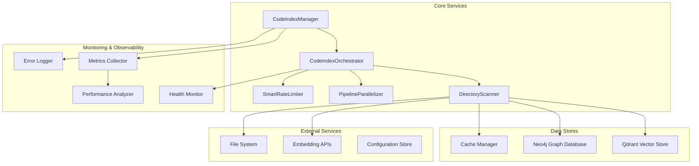

# Maintenance and Operations Guide - Indexing Pipeline

## Overview

This guide provides system administrators with comprehensive procedures for monitoring, maintaining, and troubleshooting the remediated indexing pipeline. It covers monitoring setup, alerting configuration, performance tuning, and operational best practices.

## System Architecture for Administrators

### Component Overview



### Service Dependencies

```
┌─────────────────────────────────────┬─────────────────────────────────────┐
│ Service                        │ Dependencies                           │
├─────────────────────────────────────┼─────────────────────────────────────┤
│ CodeIndexManager               │ All core services                    │
│ CodeIndexOrchestrator         │ DirectoryScanner, Parallelizers      │
│ DirectoryScanner               │ EmbeddingService, VectorStore, GraphDB │
│ PipelineParallelizer           │ Rate Limiter, Metrics Collector     │
│ SmartRateLimiter             │ Configuration, External APIs          │
│ Neo4jService                │ Connection Pool, Circuit Breaker     │
│ MetricsCollector              │ All services (for telemetry)       │
└─────────────────────────────────────┴─────────────────────────────────────┘
```

## Monitoring and Alerting

### 1. Health Monitoring Setup

#### System Health Check Endpoint

```typescript
// Health check implementation
export class HealthMonitor {
	async getSystemHealth(): Promise<SystemHealth> {
		const checks = await Promise.allSettled([
			this.checkVectorStoreHealth(),
			this.checkGraphDatabaseHealth(),
			this.checkEmbeddingServiceHealth(),
			this.checkFileSystemHealth(),
			this.checkMemoryUsage(),
			this.checkCpuUsage(),
		])

		return {
			status: this.calculateOverallStatus(checks),
			checks: this.formatCheckResults(checks),
			timestamp: new Date().toISOString(),
			uptime: this.getSystemUptime(),
			version: this.getSystemVersion(),
		}
	}

	private async checkVectorStoreHealth(): Promise<HealthCheck> {
		try {
			const startTime = Date.now()
			await this.qdrantClient.healthCheck()
			const latency = Date.now() - startTime

			return {
				service: "qdrant",
				status: "healthy",
				latency,
				message: "Vector store responding normally",
			}
		} catch (error) {
			return {
				service: "qdrant",
				status: "unhealthy",
				error: error.message,
				message: "Vector store not responding",
			}
		}
	}
}
```

#### Automated Health Monitoring

```bash
#!/bin/bash
# health-monitor.sh - System health monitoring script

# Configuration
HEALTH_CHECK_INTERVAL=30  # seconds
ALERT_THRESHOLD=3        # consecutive failures before alert
LOG_FILE="/var/log/indexing-health.log"
METRICS_FILE="/var/log/indexing-metrics.json"

# Health check function
check_health() {
    local timestamp=$(date -u +"%Y-%m-%dT%H:%M:%SZ")

    # Check vector store
    local qdrant_health=$(curl -s -o /dev/null -w "%{http_code}" http://localhost:6333/health)

    # Check Neo4j
    local neo4j_health=$(curl -s -o /dev/null -w "%{http_code}" http://localhost:7474/db/data/)

    # Check memory usage
    local memory_usage=$(ps aux | grep 'code-index' | awk '{sum+=$4} END {print sum/1024}')

    # Log results
    echo "{
        \"timestamp\": \"$timestamp\",
        \"qdrant_status\": $qdrant_health,
        \"neo4j_status\": $neo4j_health,
        \"memory_usage_mb\": $memory_usage
    }" >> $METRICS_FILE

    # Check for alerts
    if [ $qdrant_health -ne 200 ] || [ $neo4j_health -ne 200 ]; then
        echo "[$timestamp] ALERT: Service health check failed" >> $LOG_FILE
        send_alert "Indexing service health check failed"
    fi
}

# Run monitoring
while true; do
    check_health
    sleep $HEALTH_CHECK_INTERVAL
done
```

### 2. Performance Monitoring

#### Key Performance Indicators (KPIs)

##### Throughput Metrics

```typescript
interface ThroughputMetrics {
	filesPerMinute: number
	codeBlocksPerMinute: number
	embeddingsPerSecond: number
	vectorStoreOpsPerSecond: number
	graphOpsPerSecond: number
}

// Monitoring implementation
export class PerformanceMonitor {
	collectThroughputMetrics(): ThroughputMetrics {
		const recentMetrics = this.metricsCollector.getRecentMetrics(300000) // 5 minutes

		return {
			filesPerMinute: this.calculateRate(recentMetrics, "filesProcessed"),
			codeBlocksPerMinute: this.calculateRate(recentMetrics, "blocksProcessed"),
			embeddingsPerSecond: this.calculateRate(recentMetrics, "embeddingsCreated") / 60,
			vectorStoreOpsPerSecond: this.calculateRate(recentMetrics, "vectorStoreOps") / 60,
			graphOpsPerSecond: this.calculateRate(recentMetrics, "graphOps") / 60,
		}
	}
}
```

##### Latency Metrics

```typescript
interface LatencyMetrics {
	averageEmbeddingLatency: number
	p95EmbeddingLatency: number
	averageVectorStoreLatency: number
	p95VectorStoreLatency: number
	averageGraphLatency: number
	p95GraphLatency: number
	endToEndIndexingTime: number
}

// Latency monitoring
export class LatencyMonitor {
	collectLatencyMetrics(): LatencyMetrics {
		const operationMetrics = this.metricsCollector.getAllOperationMetrics()

		return {
			averageEmbeddingLatency: this.getAverageLatency(operationMetrics, "embedding"),
			p95EmbeddingLatency: this.getPercentileLatency(operationMetrics, "embedding", 95),
			averageVectorStoreLatency: this.getAverageLatency(operationMetrics, "vectorStore"),
			p95VectorStoreLatency: this.getPercentileLatency(operationMetrics, "vectorStore", 95),
			averageGraphLatency: this.getAverageLatency(operationMetrics, "graph"),
			p95GraphLatency: this.getPercentileLatency(operationMetrics, "graph", 95),
			endToEndIndexingTime: this.calculateEndToEndLatency(),
		}
	}
}
```

#### Resource Utilization Monitoring

```typescript
interface ResourceMetrics {
	cpuUsagePercent: number
	memoryUsageMB: number
	memoryUsagePercent: number
	diskUsageMB: number
	networkIOBytesPerSecond: number
	activeConnections: number
	queueSize: number
}

// Resource monitoring
export class ResourceMonitor {
	collectResourceMetrics(): ResourceMetrics {
		const memUsage = process.memoryUsage()
		const cpuUsage = process.cpuUsage()

		return {
			cpuUsagePercent: this.calculateCpuPercent(cpuUsage),
			memoryUsageMB: memUsage.heapUsed / 1024 / 1024,
			memoryUsagePercent: (memUsage.heapUsed / memUsage.heapTotal) * 100,
			diskUsageMB: this.getDiskUsage(),
			networkIOBytesPerSecond: this.getNetworkIO(),
			activeConnections: this.getActiveConnectionCount(),
			queueSize: this.getQueueSize(),
		}
	}
}
```

### 3. Alerting Configuration

#### Alert Thresholds

```yaml
# alert-config.yaml
alerts:
    performance:
        throughput:
            warning_threshold: 50 # files/minute
            critical_threshold: 25 # files/minute
        latency:
            embedding_warning: 2000 # milliseconds
            embedding_critical: 5000 # milliseconds
            vector_store_warning: 500 # milliseconds
            vector_store_critical: 2000 # milliseconds
        error_rate:
            warning_threshold: 0.05 # 5%
            critical_threshold: 0.1 # 10%

    resources:
        memory:
            warning_threshold: 80 # percent
            critical_threshold: 90 # percent
        cpu:
            warning_threshold: 75 # percent
            critical_threshold: 90 # percent
        disk:
            warning_threshold: 80 # percent
            critical_threshold: 90 # percent

    availability:
        uptime:
            warning_threshold: 99 # percent
            critical_threshold: 95 # percent
        response_time:
            warning_threshold: 5000 # milliseconds
            critical_threshold: 10000 # milliseconds
```

#### Alert Implementation

```typescript
export class AlertManager {
	private alertConfig: AlertConfiguration
	private alertHistory: Alert[] = []

	async checkAndSendAlerts(metrics: SystemMetrics): Promise<void> {
		const alerts: Alert[] = []

		// Check performance alerts
		alerts.push(...this.checkPerformanceAlerts(metrics))

		// Check resource alerts
		alerts.push(...this.checkResourceAlerts(metrics))

		// Check availability alerts
		alerts.push(...this.checkAvailabilityAlerts(metrics))

		// Send alerts
		for (const alert of alerts) {
			if (this.shouldSendAlert(alert)) {
				await this.sendAlert(alert)
				this.alertHistory.push(alert)
			}
		}
	}

	private shouldSendAlert(alert: Alert): boolean {
		// Check cooldown period
		const lastSimilarAlert = this.findLastSimilarAlert(alert)
		if (lastSimilarAlert) {
			const timeSinceLastAlert = Date.now() - lastSimilarAlert.timestamp
			return timeSinceLastAlert > this.alertConfig.cooldownPeriod
		}
		return true
	}

	private async sendAlert(alert: Alert): Promise<void> {
		const message = this.formatAlertMessage(alert)

		// Send to multiple channels
		await Promise.all([
			this.sendEmailAlert(message),
			this.sendSlackAlert(message),
			this.sendPagerDutyAlert(alert),
			this.logAlert(message),
		])
	}
}
```

## Performance Tuning

### 1. Configuration Optimization

#### Environment-Specific Tuning

##### Development Environment

```typescript
const developmentConfig: IndexingConfiguration = {
	pipeline: {
		maxConcurrency: 4, // Conservative for development
		batchSize: 500, // Smaller batches for faster feedback
		enableAdaptiveBatching: true,
		retryStrategy: "exponential",
	},
	rateLimiting: {
		enablePredictiveThrottling: true,
		predictiveThreshold: 0.7, // More conservative in development
		jitterFactor: 0.2,
	},
	monitoring: {
		enableMetricsCollection: true,
		metricsRetentionPeriod: 24 * 60 * 60 * 1000, // 24 hours
		healthCheckInterval: 30000, // 30 seconds
		enablePerformanceAlerts: false, // Reduce noise in development
	},
}
```

##### Production Environment

```typescript
const productionConfig: IndexingConfiguration = {
	pipeline: {
		maxConcurrency: 10, // Higher for production throughput
		batchSize: 2000, // Larger batches for efficiency
		enableAdaptiveBatching: true,
		retryStrategy: "exponential",
	},
	rateLimiting: {
		enablePredictiveThrottling: true,
		predictiveThreshold: 0.8, // Optimal for production
		jitterFactor: 0.1,
	},
	monitoring: {
		enableMetricsCollection: true,
		metricsRetentionPeriod: 7 * 24 * 60 * 60 * 1000, // 7 days
		healthCheckInterval: 10000, // 10 seconds
		enablePerformanceAlerts: true,
	},
	neo4j: {
		maxConnectionPoolSize: 20,
		connectionAcquisitionTimeout: 60000, // 1 minute
		maxConnectionLifetime: 3 * 60 * 60 * 1000, // 3 hours
		circuitBreakerThreshold: 10,
	},
}
```

##### High-Performance Environment

```typescript
const highPerformanceConfig: IndexingConfiguration = {
	pipeline: {
		maxConcurrency: 20, // Maximum concurrency
		batchSize: 5000, // Largest batches
		enableAdaptiveBatching: true,
		retryStrategy: "exponential",
	},
	rateLimiting: {
		enablePredictiveThrottling: true,
		predictiveThreshold: 0.9, // Aggressive throttling
		jitterFactor: 0.05, // Minimal jitter
	},
	neo4j: {
		maxConnectionPoolSize: 50,
		connectionAcquisitionTimeout: 120000, // 2 minutes
		maxConnectionLifetime: 6 * 60 * 60 * 1000, // 6 hours
		circuitBreakerThreshold: 20,
	},
}
```

### 2. Database Optimization

#### Neo4j Performance Tuning

```cypher
// Performance optimization queries
// Create optimized indexes
CREATE INDEX code_node_file_path_type IF NOT EXISTS FOR (n:CodeNode) ON (n.filePath, n.type);
CREATE INDEX code_node_type_name IF NOT EXISTS FOR (n:CodeNode) ON (n.type, n.name);

// Configure memory settings
CALL dbms.queryJmx("java.lang:type=Memory") YIELD attributes
UNWIND attributes AS attribute
WITH attribute.Name AS name, attribute.Value AS value
WHERE name IN ['HeapMemoryUsage', 'NonHeapMemoryUsage']
RETURN name, value;

// Optimize query plans
CALL dbms.explain.analyzeQuery('MATCH (n:CodeNode {filePath: $path}) RETURN n') YIELD plan
RETURN plan;
```

#### Vector Store Optimization

```bash
# Qdrant optimization configuration
# qdrant-config.yaml

storage:
  # Performance optimization
  wal_capacity_mb: 1024      # Increase for high throughput
  max_segment_size: 524288  # Larger segments for better performance

performance:
  max_search_threads: 8        # Utilize all CPU cores
  max_optimization_threads: 4
  search_limit: 1000          # Increase search limit

service:
  max_request_size_mb: 512      # Allow larger requests
  timeout_sec: 300             # Longer timeouts for complex queries
```

### 3. Resource Allocation

#### Memory Management

```typescript
export class MemoryManager {
	private memoryThresholds = {
		warning: 0.8, // 80% of available memory
		critical: 0.9, // 90% of available memory
		maximum: 0.95, // 95% of available memory
	}

	async optimizeMemoryUsage(): Promise<void> {
		const memUsage = process.memoryUsage()
		const totalMemory = memUsage.heapTotal
		const usedMemory = memUsage.heapUsed
		const usageRatio = usedMemory / totalMemory

		if (usageRatio > this.memoryThresholds.critical) {
			// Emergency memory cleanup
			await this.emergencyCleanup()
		} else if (usageRatio > this.memoryThresholds.warning) {
			// Proactive optimization
			await this.proactiveOptimization()
		}
	}

	private async emergencyCleanup(): Promise<void> {
		// Clear caches
		await this.cacheManager.clearAll()

		// Force garbage collection
		if (global.gc) {
			global.gc()
		}

		// Reduce batch sizes temporarily
		this.reduceBatchSizes()

		// Notify monitoring system
		await this.alertManager.sendAlert({
			type: "memory_critical",
			message: "Emergency memory cleanup performed",
			severity: "critical",
		})
	}
}
```

#### CPU Optimization

```typescript
export class CPUManager {
	private cpuThresholds = {
		warning: 75, // 75% CPU usage
		critical: 90, // 90% CPU usage
		maximum: 95, // 95% CPU usage
	}

	async optimizeCPUUsage(): Promise<void> {
		const cpuUsage = process.cpuUsage()
		const usagePercent = this.calculateCPUPercent(cpuUsage)

		if (usagePercent > this.cpuThresholds.critical) {
			// Reduce concurrency
			await this.reduceConcurrency()

			// Increase retry delays
			await this.increaseRetryDelays()

			// Notify monitoring system
			await this.alertManager.sendAlert({
				type: "cpu_critical",
				message: `CPU usage at ${usagePercent}%`,
				severity: "critical",
			})
		}
	}

	private async reduceConcurrency(): Promise<void> {
		const currentConfig = this.configManager.getCurrentConfig()
		const newConcurrency = Math.max(
			currentConfig.pipeline.maxConcurrency * 0.7,
			2, // Minimum concurrency
		)

		await this.configManager.updateConfig({
			pipeline: {
				...currentConfig.pipeline,
				maxConcurrency: newConcurrency,
			},
		})
	}
}
```

## Troubleshooting Procedures

### 1. Common Issues and Solutions

#### Performance Degradation

##### Symptoms

- Indexing speed decreasing over time
- Search latency increasing
- Memory usage growing continuously

##### Diagnosis Steps

```bash
# 1. Check system metrics
./scripts/check-performance.sh

# 2. Analyze recent errors
grep -i "error\|warning" /var/log/indexing.log | tail -50

# 3. Check resource usage
top -p $(pgrep -f "code-index")

# 4. Examine database performance
./scripts/check-database-performance.sh
```

##### Solutions

```typescript
// Performance recovery procedures
export class PerformanceRecovery {
	async diagnosePerformanceIssues(): Promise<DiagnosisResult> {
		const checks = await Promise.all([
			this.checkMemoryLeaks(),
			this.checkDatabaseFragmentation(),
			this.checkConnectionPoolExhaustion(),
			this.checkRateLimitingIssues(),
			this.checkDiskIOBottlenecks(),
		])

		return {
			issues: checks.filter((check) => !check.healthy),
			recommendations: checks
				.filter((check) => !check.healthy)
				.map((check) => this.generateRecommendation(check)),
			severity: this.calculateSeverity(checks),
		}
	}

	private async checkMemoryLeaks(): Promise<HealthCheck> {
		const memUsage = process.memoryUsage()
		const trend = this.analyzeMemoryTrend()

		if (trend.isIncreasing && trend.rate > 0.1) {
			return {
				healthy: false,
				issue: "memory_leak",
				details: `Memory growing at ${trend.rate}% per hour`,
				recommendation: "restart_service_and_clear_cache",
			}
		}

		return { healthy: true }
	}
}
```

#### Database Connection Issues

##### Symptoms

- Frequent connection timeouts
- Connection pool exhaustion
- Database unavailability

##### Diagnosis and Recovery

```typescript
export class DatabaseTroubleshooter {
	async diagnoseConnectionIssues(): Promise<ConnectionDiagnosis> {
		const checks = await Promise.all([
			this.checkConnectivity(),
			this.checkAuthentication(),
			this.checkDatabaseHealth(),
			this.checkNetworkLatency(),
			this.checkConfiguration(),
		])

		return {
			connectivity: checks[0],
			authentication: checks[1],
			databaseHealth: checks[2],
			networkLatency: checks[3],
			configuration: checks[4],
			rootCause: this.identifyRootCause(checks),
			solution: this.generateSolution(checks),
		}
	}

	private async checkConnectivity(): Promise<ConnectivityCheck> {
		try {
			const startTime = Date.now()
			await this.neo4jService.verifyConnectivity()
			const latency = Date.now() - startTime

			return {
				healthy: true,
				latency,
				message: `Connectivity OK, latency: ${latency}ms`,
			}
		} catch (error) {
			return {
				healthy: false,
				error: error.message,
				message: `Connectivity failed: ${error.message}`,
				recommendation: this.getConnectivityRecommendation(error),
			}
		}
	}
}
```

### 2. Emergency Procedures

#### System Recovery

##### Complete System Reset

```bash
#!/bin/bash
# emergency-reset.sh - Complete system recovery

echo "Starting emergency system reset..."

# 1. Stop all services
systemctl stop code-index-service
systemctl stop qdrant
systemctl stop neo4j

# 2. Clear caches
rm -rf /var/lib/code-index/cache/*
rm -rf /tmp/code-index-temp/*

# 3. Check filesystem integrity
fsck -f /var/lib/code-index

# 4. Restart services in correct order
systemctl start qdrant
sleep 10
systemctl start neo4j
sleep 5
systemctl start code-index-service

# 5. Verify system health
./scripts/health-check.sh

echo "Emergency reset completed"
```

##### Data Recovery

```typescript
export class DataRecovery {
	async recoverFromBackup(backupId: string): Promise<RecoveryResult> {
		try {
			// 1. Validate backup integrity
			const validation = await this.validateBackup(backupId)
			if (!validation.isValid) {
				throw new Error(`Backup ${backupId} is corrupted`)
			}

			// 2. Stop indexing operations
			await this.indexManager.stopIndexing()

			// 3. Clear current data
			await this.clearAllData()

			// 4. Restore from backup
			await this.restoreBackup(backupId)

			// 5. Rebuild indexes
			await this.rebuildIndexes()

			// 6. Verify restoration
			const verification = await this.verifyRestoration()

			return {
				success: true,
				backupId,
				restoredAt: new Date(),
				verification,
				message: `Successfully recovered from backup ${backupId}`,
			}
		} catch (error) {
			return {
				success: false,
				backupId,
				error: error.message,
				message: `Recovery failed: ${error.message}`,
			}
		}
	}
}
```

### 3. Maintenance Automation

#### Scheduled Maintenance Tasks

```bash
#!/bin/bash
# scheduled-maintenance.sh - Automated maintenance

# Daily maintenance (runs at 2 AM)
daily_maintenance() {
    echo "Starting daily maintenance..."

    # Rotate logs
    logrotate -f /etc/logrotate.d/code-index

    # Clean temporary files
    find /tmp -name "code-index-*" -mtime +1 -delete

    # Optimize databases
    curl -X POST http://localhost:7474/db/data/transaction/commit \
         -H "Content-Type: application/json" \
         -d '{"statements": ["CALL dbms.optimize()"]}'

    # Check disk space
    df -h /var/lib/code-index

    echo "Daily maintenance completed"
}

# Weekly maintenance (runs on Sunday)
weekly_maintenance() {
    echo "Starting weekly maintenance..."

    # Create full backup
    ./scripts/create-backup.sh weekly

    # Analyze performance trends
    ./scripts/analyze-performance-trends.sh

    # Update statistics
    curl -X POST http://localhost:6333/collections/code-index/points \
         -H "Content-Type: application/json" \
         -d '{"operation": "update_stats"}'

    echo "Weekly maintenance completed"
}

# Monthly maintenance (runs on 1st)
monthly_maintenance() {
    echo "Starting monthly maintenance..."

    # Archive old logs
    find /var/log/code-index -name "*.log" -mtime +30 -exec gzip {} \;

    # Database maintenance
    ./scripts/database-maintenance.sh

    # Performance baseline update
    ./scripts/update-performance-baseline.sh

    echo "Monthly maintenance completed"
}
```

## Operational Best Practices

### 1. Deployment Management

#### Configuration Management

```typescript
// Environment-specific configuration management
export class ConfigurationManager {
	async loadEnvironmentConfig(environment: string): Promise<IndexingConfiguration> {
		const baseConfig = await this.loadBaseConfig()
		const envOverrides = await this.loadEnvironmentOverrides(environment)
		const secrets = await this.loadSecrets(environment)

		return this.mergeConfigurations(baseConfig, envOverrides, secrets)
	}

	async validateConfiguration(config: IndexingConfiguration): Promise<ValidationResult> {
		const validationRules = [
			this.validateConcurrencySettings,
			this.validateDatabaseSettings,
			this.validateRateLimitSettings,
			this.validateResourceLimits,
		]

		for (const rule of validationRules) {
			const result = await rule(config)
			if (!result.isValid) {
				return {
					isValid: false,
					errors: [result.error],
					warnings: result.warnings || [],
				}
			}
		}

		return {
			isValid: true,
			warnings: this.collectWarnings(config),
		}
	}
}
```

#### Rollback Procedures

```typescript
export class DeploymentManager {
	async deployWithRollback(newVersion: string): Promise<DeploymentResult> {
		const currentVersion = this.getCurrentVersion()
		const rollbackData = await this.createRollbackSnapshot()

		try {
			// Deploy new version
			await this.deployVersion(newVersion)

			// Health check
			const healthCheck = await this.performHealthCheck()
			if (!healthCheck.isHealthy) {
				throw new Error(`Health check failed: ${healthCheck.issues.join(", ")}`)
			}

			// Performance validation
			const perfCheck = await this.validatePerformance()
			if (!perfCheck.meetsBaseline) {
				throw new Error(`Performance regression detected: ${perfCheck.issues.join(", ")}`)
			}

			return {
				success: true,
				version: newVersion,
				deployedAt: new Date(),
			}
		} catch (error) {
			// Automatic rollback
			console.error(`Deployment failed: ${error.message}. Initiating rollback...`)

			try {
				await this.rollback(rollbackData)
				return {
					success: false,
					version: currentVersion,
					rollbackAt: new Date(),
					error: error.message,
					message: `Deployment failed and rolled back to ${currentVersion}`,
				}
			} catch (rollbackError) {
				return {
					success: false,
					version: "unknown",
					error: `${error.message}; Rollback failed: ${rollbackError.message}`,
					message: "Deployment failed and rollback failed - manual intervention required",
				}
			}
		}
	}
}
```

### 2. Security Management

#### Access Control

```typescript
export class SecurityManager {
	async validateAccess(request: AccessRequest): Promise<AccessResult> {
		// Check authentication
		const authResult = await this.authenticate(request.credentials)
		if (!authResult.isValid) {
			return {
				granted: false,
				reason: "authentication_failed",
				user: request.userId,
			}
		}

		// Check authorization
		const authzResult = await this.authorize(authResult.user, request.resource)
		if (!authzResult.isAuthorized) {
			return {
				granted: false,
				reason: "authorization_failed",
				user: request.userId,
				resource: request.resource,
			}
		}

		// Log access attempt
		await this.logAccessAttempt({
			user: request.userId,
			resource: request.resource,
			action: request.action,
			granted: true,
			timestamp: new Date(),
		})

		return {
			granted: true,
			user: authResult.user,
			permissions: authzResult.permissions,
		}
	}
}
```

#### Audit Logging

```typescript
export class AuditLogger {
	async logSecurityEvent(event: SecurityEvent): Promise<void> {
		const auditEntry = {
			timestamp: new Date().toISOString(),
			eventType: event.type,
			userId: event.userId,
			resource: event.resource,
			action: event.action,
			result: event.result,
			sourceIP: event.sourceIP,
			userAgent: event.userAgent,
			details: event.details,
		}

		// Write to secure audit log
		await this.writeToAuditLog(auditEntry)

		// Check for security alerts
		await this.checkSecurityAlerts(auditEntry)
	}

	private async checkSecurityAlerts(event: AuditEntry): Promise<void> {
		// Check for suspicious patterns
		const alerts = []

		if (await this.isBruteForceAttack(event)) {
			alerts.push({
				type: "brute_force",
				severity: "high",
				message: `Potential brute force attack from ${event.sourceIP}`,
			})
		}

		if (await this.isUnauthorizedAccess(event)) {
			alerts.push({
				type: "unauthorized_access",
				severity: "medium",
				message: `Unauthorized access attempt to ${event.resource}`,
			})
		}

		// Send alerts
		for (const alert of alerts) {
			await this.sendSecurityAlert(alert)
		}
	}
}
```

## Conclusion

The maintenance and operations guide provides system administrators with comprehensive tools and procedures to ensure the indexing pipeline operates reliably and efficiently. Key benefits include:

1. **Proactive Monitoring:** Early detection of issues before they impact users
2. **Automated Recovery:** Self-healing capabilities reduce manual intervention
3. **Performance Optimization:** Environment-specific tuning for optimal performance
4. **Comprehensive Troubleshooting:** Systematic approach to problem diagnosis and resolution
5. **Operational Excellence:** Best practices for deployment, security, and maintenance

The remediated indexing pipeline is designed for minimal maintenance overhead while providing maximum reliability and performance. Regular monitoring and occasional maintenance ensure continued optimal operation.
