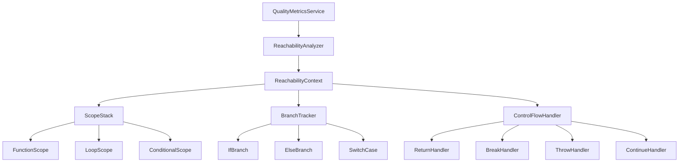

# Scoped Reachability Context System Design

## 1. Current Implementation Issues

The current boolean `hasUnreachablePath` flag in the quality metrics service has several critical issues:

### 1.1 False Positives

- **Single Flag Problem**: Uses one boolean for the entire traversal, causing false positives
- **Scope Bleeding**: Once set to `true`, it affects all subsequent code regardless of scope boundaries
- **No Context Awareness**: Doesn't differentiate between different types of unreachable code

### 1.2 Limited Scope Handling

- **Function Boundaries**: Doesn't properly reset when entering new functions
- **Loop Constructs**: Incorrectly handles `break` and `continue` statements
- **Conditional Branches**: Cannot track reachability per branch

### 1.3 Control Flow Issues

- **Return Statements**: Treats `return` as globally terminating rather than function-scoped
- **Exception Handling**: Doesn't properly handle `throw` statements within try-catch blocks
- **Nested Structures**: Fails with deeply nested control flow constructs

## 2. New System Architecture

### 2.1 Core Design Principles

1. **Scope-Isolation**: Each scope (function, loop, conditional) maintains independent reachability state
2. **Stack-Based Tracking**: Use a stack to manage nested scopes properly
3. **Context-Aware Analysis**: Different handling for different control flow constructs
4. **Branch-Specific Tracking**: Track reachability for each branch separately
5. **Efficient Memory Usage**: Minimize memory overhead while maintaining accuracy

### 2.2 High-Level Architecture



## 3. Interface Definitions

### 3.1 Core Interfaces

```typescript
/**
 * Represents the reachability state within a specific scope
 */
interface ReachabilityState {
	/** Whether code in this scope is reachable */
	isReachable: boolean
	/** Reason for unreachability, if applicable */
	unreachableReason?: UnreachableReason
	/** Line number where unreachability began */
	unreachableAt?: number
	/** Type of scope */
	scopeType: ScopeType
}

/**
 * Types of scopes that can affect reachability
 */
enum ScopeType {
	FUNCTION = "function",
	LOOP = "loop",
	CONDITIONAL = "conditional",
	TRY_CATCH = "try_catch",
	SWITCH = "switch",
	BLOCK = "block",
}

/**
 * Reasons why code might be unreachable
 */
enum UnreachableReason {
	AFTER_RETURN = "after_return",
	AFTER_THROW = "after_throw",
	AFTER_BREAK = "after_break",
	AFTER_CONTINUE = "after_continue",
	CONDITIONAL_FALSE = "conditional_false",
	DEAD_CODE = "dead_code",
}

/**
 * Represents a branch in conditional control flow
 */
interface BranchContext {
	/** Branch identifier */
	id: string
	/** Whether this branch is reachable */
	isReachable: boolean
	/** Condition that determines reachability */
	condition?: string
	/** Parent conditional node */
	parentNode: any // AST node
}

/**
 * Context for tracking reachability across scopes and branches
 */
interface ReachabilityContext {
	/** Stack of reachability states for nested scopes */
	scopeStack: ReachabilityState[]
	/** Current branch contexts for conditional statements */
	branchContexts: BranchContext[]
	/** Current active scope */
	currentScope: ReachabilityState | null
	/** Unreachable code nodes found during analysis */
	unreachableNodes: UnreachableNode[]
}

/**
 * Information about unreachable code
 */
interface UnreachableNode {
	/** AST node that is unreachable */
	node: any // AST node
	/** Reason for unreachability */
	reason: UnreachableReason
	/** Scope where unreachability was detected */
	scopeType: ScopeType
	/** Line number */
	line: number
	/** Code snippet */
	snippet: string
}
```

### 3.2 Handler Interfaces

```typescript
/**
 * Handles specific control flow constructs
 */
interface ControlFlowHandler {
	/** Type of control flow this handler manages */
	readonly type: string

	/** Process a control flow node and update reachability context */
	process(node: any, context: ReachabilityContext): void

	/** Check if a node should be handled by this handler */
	canHandle(nodeType: string): boolean
}

/**
 * Handler for return statements
 */
interface ReturnHandler extends ControlFlowHandler {
	/** Mark current function scope as having returned */
	processReturn(node: any, context: ReachabilityContext): void
}

/**
 * Handler for break statements
 */
interface BreakHandler extends ControlFlowHandler {
	/** Mark current loop scope as broken */
	processBreak(node: any, context: ReachabilityContext): void
}

/**
 * Handler for conditional statements
 */
interface ConditionalHandler extends ControlFlowHandler {
	/** Process if/else statements with branch-specific reachability */
	processConditional(node: any, context: ReachabilityContext): void

	/** Merge reachability from multiple branches */
	mergeBranches(branches: BranchContext[]): ReachabilityState
}
```

## 4. ReachabilityContext Class Design

### 4.1 Core Class Structure

```typescript
class ReachabilityContext {
	private scopeStack: ReachabilityState[] = []
	private branchContexts: BranchContext[] = []
	private unreachableNodes: UnreachableNode[] = []
	private controlFlowHandlers: Map<string, ControlFlowHandler> = new Map()

	constructor() {
		this.initializeHandlers()
	}

	/**
	 * Enter a new scope with initial reachability state
	 */
	enterScope(type: ScopeType, node?: any): void {
		const newScope: ReachabilityState = {
			isReachable: this.getCurrentReachability(),
			scopeType: type,
		}

		this.scopeStack.push(newScope)
		this.currentScope = newScope
	}

	/**
	 * Exit the current scope and merge reachability state
	 */
	exitScope(): void {
		if (this.scopeStack.length > 0) {
			const exitedScope = this.scopeStack.pop()!

			// Merge reachability state with parent scope
			if (this.scopeStack.length > 0) {
				const parentScope = this.scopeStack[this.scopeStack.length - 1]
				// Only merge if parent scope is still reachable
				if (parentScope.isReachable && !exitedScope.isReachable) {
					// Handle scope-specific merging logic
					this.mergeScopeStates(parentScope, exitedScope)
				}
			}

			this.currentScope = this.scopeStack.length > 0 ? this.scopeStack[this.scopeStack.length - 1] : null
		}
	}

	/**
	 * Mark current scope as unreachable with specific reason
	 */
	markUnreachable(reason: UnreachableReason, atLine?: number): void {
		if (this.currentScope) {
			this.currentScope.isReachable = false
			this.currentScope.unreachableReason = reason
			this.currentScope.unreachableAt = atLine
		}
	}

	/**
	 * Get current reachability state
	 */
	getCurrentReachability(): boolean {
		if (this.scopeStack.length === 0) return true

		// Check if any scope in the stack is unreachable
		return this.scopeStack.every((scope) => scope.isReachable)
	}

	/**
	 * Add an unreachable node to the results
	 */
	addUnreachableNode(node: any, reason: UnreachableReason): void {
		const unreachableNode: UnreachableNode = {
			node,
			reason,
			scopeType: this.currentScope?.scopeType || ScopeType.BLOCK,
			line: node.startPosition.row + 1,
			snippet: node.text.trim().substring(0, 100),
		}

		this.unreachableNodes.push(unreachableNode)
	}

	/**
	 * Process a node using appropriate control flow handler
	 */
	processNode(node: any): void {
		const handler = this.controlFlowHandlers.get(node.type)
		if (handler) {
			handler.process(node, this)
		}

		// Check if current node is unreachable
		if (!this.getCurrentReachability() && this.isSignificantStatement(node)) {
			const reason = this.currentScope?.unreachableReason || UnreachableReason.DEAD_CODE
			this.addUnreachableNode(node, reason)
		}
	}

	/**
	 * Get all unreachable nodes found during analysis
	 */
	getUnreachableNodes(): UnreachableNode[] {
		return [...this.unreachableNodes]
	}

	/**
	 * Reset context for new analysis
	 */
	reset(): void {
		this.scopeStack = []
		this.branchContexts = []
		this.unreachableNodes = []
		this.currentScope = null
	}

	private initializeHandlers(): void {
		// Initialize control flow handlers
		this.controlFlowHandlers.set("return_statement", new ReturnHandler())
		this.controlFlowHandlers.set("throw_statement", new ThrowHandler())
		this.controlFlowHandlers.set("break_statement", new BreakHandler())
		this.controlFlowHandlers.set("continue_statement", new ContinueHandler())
		this.controlFlowHandlers.set("if_statement", new ConditionalHandler())
		this.controlFlowHandlers.set("switch_statement", new SwitchHandler())
	}

	private isSignificantStatement(node: any): boolean {
		// Implementation to check if node is significant enough to report
		const insignificantTypes = ["comment", ";", "{", "}", "program"]
		return !insignificantTypes.includes(node.type) && node.text.trim().length > 0
	}

	private mergeScopeStates(parent: ReachabilityState, child: ReachabilityState): void {
		// Logic to merge child scope state back into parent
		// This handles cases like conditional branches
	}
}
```

## 5. Control Flow Handlers

### 5.1 Return Handler

```typescript
class ReturnHandler implements ControlFlowHandler {
	readonly type = "return_statement"

	canHandle(nodeType: string): boolean {
		return nodeType === "return_statement"
	}

	process(node: any, context: ReachabilityContext): void {
		this.processReturn(node, context)
	}

	processReturn(node: any, context: ReachabilityContext): void {
		// Find the nearest function scope
		const functionScope = context.getScopeStack().find((scope) => scope.scopeType === ScopeType.FUNCTION)

		if (functionScope) {
			functionScope.isReachable = false
			functionScope.unreachableReason = UnreachableReason.AFTER_RETURN
			functionScope.unreachableAt = node.startPosition.row + 1
		}
	}
}
```

### 5.2 Break Handler

```typescript
class BreakHandler implements ControlFlowHandler {
	readonly type = "break_statement"

	canHandle(nodeType: string): boolean {
		return nodeType === "break_statement"
	}

	process(node: any, context: ReachabilityContext): void {
		this.processBreak(node, context)
	}

	processBreak(node: any, context: ReachabilityContext): void {
		// Find the nearest loop scope
		const loopScope = context.getScopeStack().find((scope) => scope.scopeType === ScopeType.LOOP)

		if (loopScope) {
			loopScope.isReachable = false
			loopScope.unreachableReason = UnreachableReason.AFTER_BREAK
			loopScope.unreachableAt = node.startPosition.row + 1
		}
	}
}
```

### 5.3 Conditional Handler

```typescript
class ConditionalHandler implements ControlFlowHandler {
	readonly type = "if_statement"

	canHandle(nodeType: string): boolean {
		return nodeType === "if_statement" || nodeType === "elif_clause"
	}

	process(node: any, context: ReachabilityContext): void {
		this.processConditional(node, context)
	}

	processConditional(node: any, context: ReachabilityContext): void {
		// Create branch contexts for if and else branches
		const ifBranch: BranchContext = {
			id: `if_${node.startPosition.row}`,
			isReachable: context.getCurrentReachability(),
			condition: node.childForFieldName("condition")?.text,
			parentNode: node,
		}

		context.addBranchContext(ifBranch)

		// Enter conditional scope
		context.enterScope(ScopeType.CONDITIONAL, node)

		// Process if branch
		const consequenceNode = node.childForFieldName("consequence")
		if (consequenceNode) {
			this.processBranch(consequenceNode, context, ifBranch)
		}

		// Process else branch if present
		const alternativeNode = node.childForFieldName("alternative")
		if (alternativeNode) {
			const elseBranch: BranchContext = {
				id: `else_${node.startPosition.row}`,
				isReachable: context.getCurrentReachability(),
				condition: "else",
				parentNode: node,
			}

			context.addBranchContext(elseBranch)
			this.processBranch(alternativeNode, context, elseBranch)
		}

		// Exit conditional scope
		context.exitScope()

		// Merge branch reachability
		this.mergeBranches(
			[ifBranch, alternativeNode ? context.getBranchContext(`else_${node.startPosition.row}`) : null].filter(
				Boolean,
			),
			context,
		)
	}

	private processBranch(node: any, context: ReachabilityContext, branch: BranchContext): void {
		// Process the branch with its own reachability context
		// This allows for independent tracking of each branch
	}

	mergeBranches(branches: BranchContext[], context: ReachabilityContext): void {
		// Merge reachability from all branches
		// A scope is reachable if ANY branch is reachable
		const hasReachableBranch = branches.some((branch) => branch.isReachable)

		if (!hasReachableBranch) {
			context.markUnreachable(UnreachableReason.CONDITIONAL_FALSE)
		}
	}
}
```

## 6. Integration with Quality Metrics Service

### 6.1 Modified findUnreachableNodes Method

```typescript
class QualityMetricsService {
	private reachabilityAnalyzer: ReachabilityAnalyzer

	constructor(private neo4jService: INeo4jService | null) {
		this.reachabilityAnalyzer = new ReachabilityAnalyzer()
	}

	/**
	 * Finds unreachable nodes using the new scoped reachability context system
	 */
	private findUnreachableNodes(rootNode: Node, language: string): Node[] {
		// Create new reachability context for this analysis
		const context = new ReachabilityContext()

		// Analyze the AST with proper scope tracking
		this.reachabilityAnalyzer.analyze(rootNode, context, language)

		// Convert unreachable nodes back to the expected format
		return context.getUnreachableNodes().map((unreachable) => unreachable.node)
	}

	/**
	 * Analyzes a file for unreachable code using the new system
	 */
	private async analyzeFileForUnreachableCode(filePath: string): Promise<CodeReference[]> {
		try {
			// Load language parser for the file
			await this.loadLanguageParser(filePath)
			const ext = path.extname(filePath).toLowerCase().slice(1)
			const languageParser = this.languageParsers[ext]

			if (!languageParser) {
				return []
			}

			// Read and parse the file
			const sourceCode = await readFile(filePath, "utf8")
			const tree = languageParser.parser.parse(sourceCode)

			if (!tree || !tree.rootNode) {
				return []
			}

			// Use the new reachability analyzer
			const context = new ReachabilityContext()
			this.reachabilityAnalyzer.analyze(tree.rootNode, context, ext)

			// Convert to CodeReference objects
			return context.getUnreachableNodes().map((unreachable) => ({
				nodeId: `unreachable-${filePath}-${unreachable.line}`,
				name: `unreachable_code_${unreachable.reason}`,
				filePath,
				startLine: unreachable.line,
				endLine: unreachable.node.endPosition.row + 1,
				type: unreachable.node.type,
				snippet: unreachable.snippet,
			}))
		} catch (error) {
			console.debug(`Failed to analyze file ${filePath} for unreachable code:`, error)
			return []
		}
	}
}
```

### 6.2 ReachabilityAnalyzer Class

```typescript
class ReachabilityAnalyzer {
	private context: ReachabilityContext | null = null

	/**
	 * Analyzes an AST node for unreachable code
	 */
	analyze(rootNode: any, context: ReachabilityContext, language: string): void {
		this.context = context

		// Start analysis at root level
		context.enterScope(ScopeType.BLOCK, rootNode)

		// Traverse the AST
		this.traverseNode(rootNode)

		// Exit root scope
		context.exitScope()
	}

	/**
	 * Traverses AST nodes with proper scope management
	 */
	private traverseNode(node: any): void {
		if (!this.context) return

		// Process the current node
		this.context.processNode(node)

		// Handle scope-entering nodes
		if (this.isScopeEnteringNode(node)) {
			this.handleScopeEntry(node)
		}

		// Traverse children
		for (const child of node.children || []) {
			if (child) {
				this.traverseNode(child)
			}
		}

		// Handle scope-exiting nodes
		if (this.isScopeExitingNode(node)) {
			this.handleScopeExit(node)
		}
	}

	private isScopeEnteringNode(node: any): boolean {
		const scopeEnteringTypes = [
			"function_declaration",
			"function_definition",
			"arrow_function",
			"for_statement",
			"while_statement",
			"do_statement",
			"if_statement",
			"switch_statement",
			"try_statement",
		]

		return scopeEnteringTypes.includes(node.type)
	}

	private isScopeExitingNode(node: any): boolean {
		// Nodes that typically end a scope
		return this.isScopeEnteringNode(node)
	}

	private handleScopeEntry(node: any): void {
		if (!this.context) return

		let scopeType: ScopeType

		switch (node.type) {
			case "function_declaration":
			case "function_definition":
			case "arrow_function":
				scopeType = ScopeType.FUNCTION
				break
			case "for_statement":
			case "while_statement":
			case "do_statement":
				scopeType = ScopeType.LOOP
				break
			case "if_statement":
				scopeType = ScopeType.CONDITIONAL
				break
			case "switch_statement":
				scopeType = ScopeType.SWITCH
				break
			case "try_statement":
				scopeType = ScopeType.TRY_CATCH
				break
			default:
				scopeType = ScopeType.BLOCK
		}

		this.context.enterScope(scopeType, node)
	}

	private handleScopeExit(node: any): void {
		if (!this.context) return

		this.context.exitScope()
	}
}
```

## 7. Performance and Memory Considerations

### 7.1 Memory Optimization Strategies

1. **Scope Stack Limiting**: Limit maximum depth of scope stack to prevent stack overflow
2. **Node Reference Management**: Store minimal node information in unreachable nodes
3. **Context Reuse**: Reuse context objects where possible
4. **Lazy Evaluation**: Only compute reachability when needed

### 7.2 Performance Optimizations

1. **Handler Caching**: Cache control flow handlers for repeated use
2. **Early Termination**: Stop traversal when entire branch becomes unreachable
3. **Parallel Processing**: Process multiple files in parallel where possible
4. **Incremental Analysis**: Only reanalyze changed parts of code

### 7.3 Memory Usage Estimates

```typescript
/**
 * Memory usage estimates for the new system
 */
interface MemoryUsageEstimates {
	/** Memory per scope stack entry */
	scopeEntry: number // ~32 bytes
	/** Memory per branch context */
	branchContext: number // ~64 bytes
	/** Memory per unreachable node */
	unreachableNode: number // ~128 bytes
	/** Maximum memory per file analysis */
	maxPerFile: number // ~1MB for typical files
}
```

## 8. Migration Strategy

### 8.1 Phase 1: Implementation

1. Create new ReachabilityContext class
2. Implement control flow handlers
3. Create ReachabilityAnalyzer
4. Add unit tests

### 8.2 Phase 2: Integration

1. Modify QualityMetricsService to use new system
2. Update interface methods
3. Add integration tests
4. Performance benchmarking

### 8.3 Phase 3: Rollout

1. Feature flag for gradual rollout
2. Monitor for false positives/negatives
3. Collect performance metrics
4. Full rollout after validation

## 9. Testing Strategy

### 9.1 Unit Tests

- Test each control flow handler independently
- Test scope stack operations
- Test branch merging logic
- Test edge cases and error conditions

### 9.2 Integration Tests

- Test with real JavaScript/TypeScript files
- Test complex nested control flow
- Test performance with large files
- Compare results with current implementation

### 9.3 Regression Tests

- Ensure no false positives in working code
- Verify detection of actual unreachable code
- Test with various code patterns and styles

## 10. Future Enhancements

### 10.1 Language Support

- Extend to other languages (Python, Java, etc.)
- Language-specific control flow handlers
- Cross-language compatibility

### 10.2 Advanced Analysis

- Data flow analysis for more precise detection
- Interprocedural analysis
- Static analysis integration

### 10.3 Performance Improvements

- Incremental analysis for changed code only
- Parallel processing of multiple files
- Caching of analysis results
